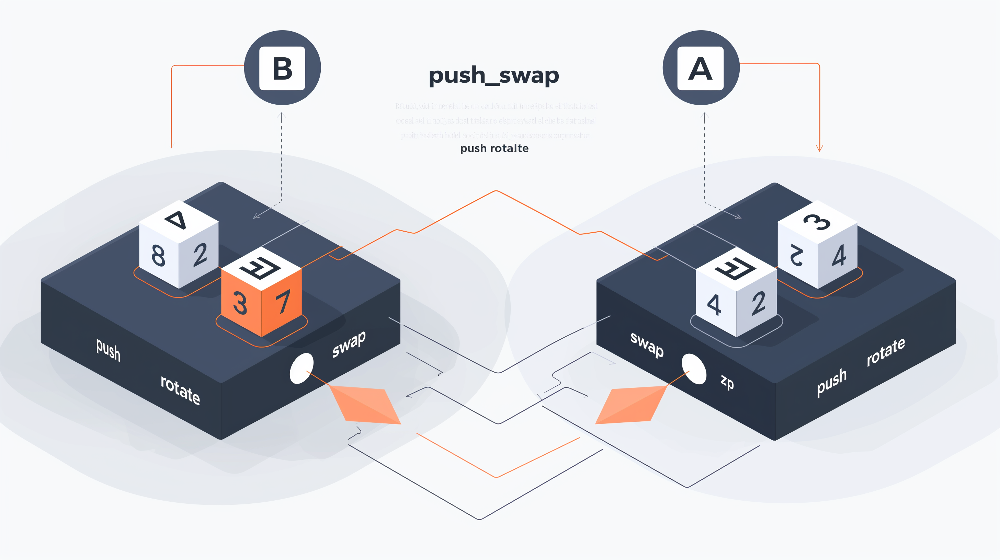

# Push_Swap

Le projet push_swap de l'École 42 est conçu pour approfondir la compréhension des algorithmes de tri et des structures de données, en particulier les piles (stacks). Les étudiants doivent développer un programme en C capable de trier une liste d'entiers en utilisant un ensemble limité d'opérations sur deux piles, tout en minimisant le nombre de mouvements effectués.

🎯 Objectifs du Projet
Implémentation d'Algorithmes de Tri : Concevoir et implémenter des algorithmes efficaces pour trier des nombres en utilisant des piles.

Gestion des Piles : Manipuler deux piles nommées a et b pour réaliser le tri, en appliquant des opérations spécifiques.

Optimisation des Opérations : Minimiser le nombre total d'opérations nécessaires pour trier la liste initiale.

🛠️ Spécifications Techniques
Programme Principal : Un exécutable nommé push_swap qui prend en entrée une liste d'entiers non triés et affiche les opérations nécessaires pour les trier.

Opérations Autorisées :

sa (swap a): Échange les deux premiers éléments de la pile a.

sb (swap b): Échange les deux premiers éléments de la pile b.

ss: Effectue sa et sb simultanément.

pa (push a): Prend le premier élément de b et le place sur a.

pb (push b): Prend le premier élément de a et le place sur b.

ra (rotate a): Fait pivoter tous les éléments de a vers le haut (le premier devient le dernier).

rb (rotate b): Fait pivoter tous les éléments de b vers le haut.

rr: Effectue ra et rb simultanément.

rra (reverse rotate a): Fait pivoter tous les éléments de a vers le bas (le dernier devient le premier).

rrb (reverse rotate b): Fait pivoter tous les éléments de b vers le bas.

rrr: Effectue rra et rrb simultanément.

Contraintes :

Le programme doit gérer les erreurs d'entrée, telles que les arguments non numériques ou les doublons.

Aucune fonction de tri prédéfinie n'est autorisée.

Le nombre d'opérations doit être optimisé pour obtenir le meilleur score possible lors de l'évaluation.

🔧 Approche d'Implémentation
Analyse des Entrées :

Vérifier la validité des arguments fournis (nombres entiers, absence de doublons).

Initialiser les piles a et b en conséquence.

Choix de l'Algorithme de Tri :

Pour un petit nombre d'éléments (par exemple, 3 ou 5), utiliser des algorithmes simples comme le tri par sélection ou le tri à bulles.

Pour un plus grand nombre d'éléments, implémenter des algorithmes plus complexes, tels que le tri par insertion ou des variantes du tri rapide adaptées aux piles.

Optimisation des Opérations :

Analyser les séquences d'opérations pour identifier les redondances ou les mouvements inutiles.

Combiner des opérations lorsque cela est possible (par exemple, utiliser ss au lieu de sa suivi de sb).

Gestion de la Mémoire :

Assurer une allocation et une libération appropriées de la mémoire pour éviter les fuites.

Utiliser des structures de données appropriées pour représenter les piles et faciliter les opérations.

📂 Structure du Projet
Fichiers Principaux :

push_swap.c : Contient la fonction main et la logique générale du programme.

operations.c : Implémente les fonctions correspondant aux opérations autorisées (sa, pb, etc.).

sorting_algorithms.c : Contient les différentes stratégies de tri en fonction de la taille de la pile.

utils.c : Fonctions utilitaires pour la gestion des piles et la validation des entrées.

Fichiers d'En-tête :

push_swap.h : Déclare les prototypes de fonctions et les structures de données utilisées.
Compilation :

Utilisation d'un Makefile pour automatiser la compilation et gérer les dépendances.
🧪 Tests et Validation
Cas de Test :

Listes déjà triées, inversées, ou avec des motifs spécifiques.

Grandes listes générées aléatoirement pour évaluer les performances.

Outils de Test :

Scripts pour automatiser les tests et comparer les résultats avec des solutions de référence.

Utilisation d'outils de débogage et de profilage pour identifier les goulots d'étranglement et optimiser le code.

📚 Ressources Utiles

[My journey to find a good sorting algorithm for the Push_Swap 42 project][https://m4nnb3ll.medium.com/my-journey-to-find-a-good-sorting-algorithm-for-the-push-swap-42-project-4a18bc38b474]
[Niimphu / push_swap_visualiser][https://github.com/Niimphu/push_swap_visualiser]
[vidéo explicative push_swap][https://www.youtube.com/watch?v=OaG81sDEpVk]